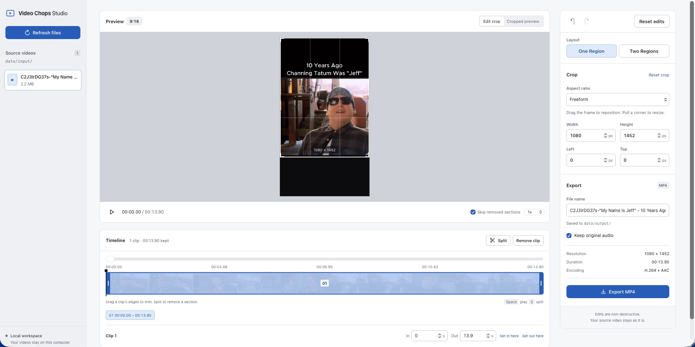

# Video Chops Studio

A local video editor for cropping, trimming, and cutting clips, and for combining two regions of one video into a single MP4. Everything runs on your computer.



## Requirements

Node.js 24+, npm, [just](https://github.com/casey/just), and FFmpeg with `ffmpeg` and `ffprobe` on your PATH. `just init` also requires the check tools codespell, Semgrep, CodeQL, Gitleaks, ShellCheck, and shfmt. `just check` verifies them and prints install commands.

## Start

```sh
just init   # install dependencies
just run    # build, start, and open http://127.0.0.1:4310
```

Put videos (MP4, MOV, M4V, WebM, MKV, AVI) in `data/input/` and click **Refresh files**. Exports are saved to `data/output/`. Stop the studio with **Shut down studio** at the bottom of the sidebar or `just stop`; a running export finishes first.

## Edit and export

1. Select a source in the sidebar. The first load prepares a preview, which takes longer for long videos.
2. **Crop:** drag the frame or its corners, pick an aspect ratio, or enter exact pixel values. **Cropped preview** shows the result.
3. **Trim:** drag the clip's timeline edges, edit its In/Out seconds, or use **Set in here** and **Set out here** at the playhead.
4. **Cut:** click **Split** at the start and end of an unwanted section, select it, and click **Remove clip**. **Skip removed sections** previews the cuts.
5. Choose a file name and whether to keep audio, then click **Export MP4**.

Exports use the source resolution and never overwrite an existing file or modify the source. Edits and undo history last until the page reloads.

## Combine two video regions

1. Click **Two Regions** under **Layout**.
2. Click **Draw 1** and drag a rectangle over the source, then do the same with **Draw 2**.
3. Pick the **Output canvas** aspect ratio and stack the regions **Vertical** or **Horizontal** with a gap, or drag and resize them in **Output**. Regions are never upscaled.
4. Optionally set a background color or image and a frame under **Background & frame**. Uploaded images are stored in `data/input/`.
5. Preview with **Play output**, then click **Export MP4**.

## Keyboard controls

| Key                  | Action                                 |
| -------------------- | -------------------------------------- |
| Space                | Play or pause                          |
| S                    | Split at the playhead                  |
| I / O                | Set the selected clip's in / out point |
| Delete / Backspace   | Remove the selected clip               |
| Left / Right         | Step one source frame                  |
| Shift + Left / Right | Step one second                        |
| Cmd/Ctrl + Z         | Undo                                   |
| Cmd/Ctrl + Shift + Z | Redo                                   |

Shortcuts work when no form field has focus. Arrow keys also move or resize a focused crop corner, trim handle, or output region; hold Shift for larger steps.

## Development

`just help` lists every recipe. `just test` runs the tests, and `just ci` runs all checks, including linting, security scans, coverage, CodeQL, and mutation testing.
